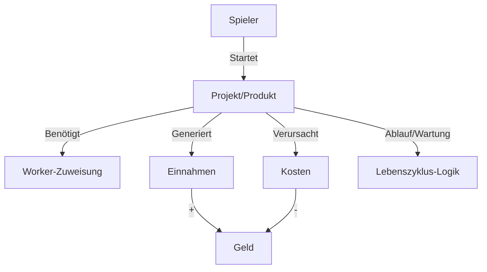
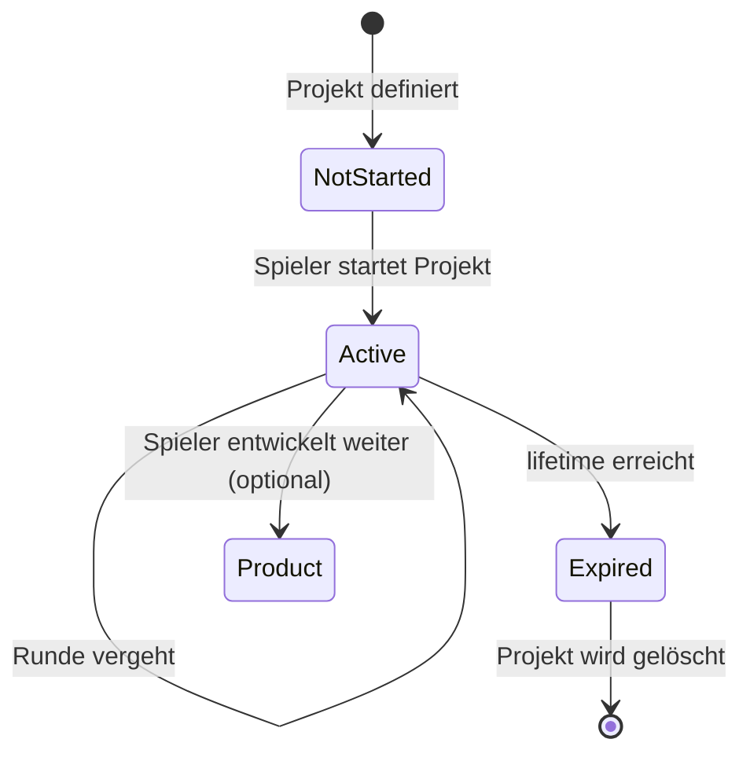
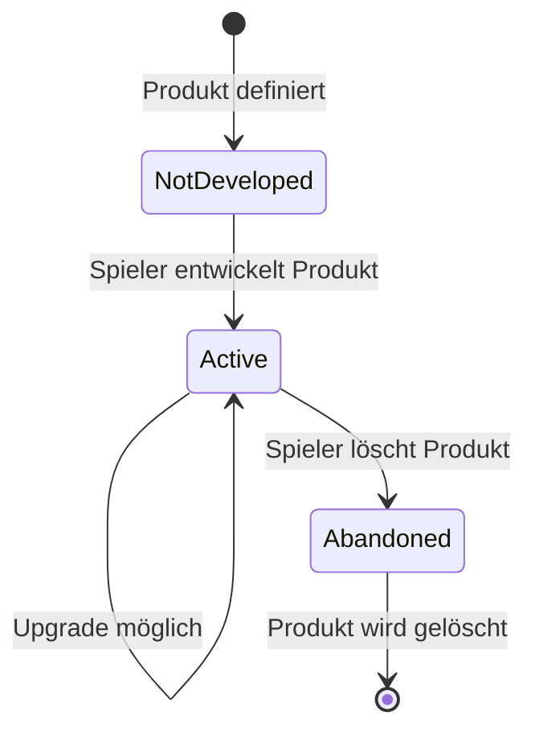

# Spezifikation: Projekt- und Produkt-System für Automate Inc.

> **Version:** 1.0  
> **Letzte Aktualisierung:** 22. August 2026  
> **Status:** Finalisiert  
> **Abhängigkeiten:** GAME_DESIGN.md, VISION.md

---

## 📌 1. Übersicht

### 1.1 Zweck
Dieses Dokument spezifiziert das **Projekt- und Produkt-System** für *Automate Inc.* und ersetzt die bisherige vereinfachte Einkommensberechnung durch ein **dynamisches, rollenbasiertes System**. 

### 1.2 Kernprinzipien
✅ **Generisch & erweiterbar**: Neue Projekte/Produkte können **ohne Code-Änderungen** hinzugefügt werden (nur Konfiguration).
✅ **Flexible Anforderungen**: Jedes Projekt/Produkt definiert **eigene Kosten, Einnahmen und Voraussetzungen**.
✅ **Lebenszyklen**:
- **Projekte** → Zeitlich begrenzt (automatisches Ende nach Ablauf)
- **Produkte** → Dauerhaft (mit Wartungskosten und Upgrades)
✅ **Worker-basiert**: Einnahmen und Kosten hängen von **zugewiesenen Workern** ab.

---

## 🏗️ 2. Architektur

### 2.1 Komponenten
| Komponente | Verantwortlichkeit | Datei |
|------------|---------------------|-------|
| **`Project`** | Basis-Klasse für alle Projekte | `core/projects.py` |
| **`Product`** | Basis-Klasse für alle Produkte | `core/projects.py` |
| **`ProjectType`** | Enum für Projekt-Kategorien (z. B. `WEBSITE`, `ECOMMERCE`) | `core/projects.py` |
| **`ProductType`** | Enum für Produkt-Kategorien (z. B. `SAAS`, `DESKTOP_APP`) | `core/projects.py` |
| **`ProjectRegistry`** | Zentrale Registrierung aller verfügbaren Projekte/Produkte | `core/projects.py` |
| **`GameState`** | Verwaltet `active_projects` und `active_products` | `core/state.py` |
| **`Game`** | Steuert Lebenszyklen, Einkommensberechnung, Wartung | `core/game.py` |

---

### 2.2 Datenfluss


---

## 📦 3. Projekt-Typen

### 3.1 Basis-Klasse: `Project`
**Attribute:**
| Attribut | Typ | Beschreibung | Beispiel |
|----------|-----|--------------|----------|
| `id` | `str` | Eindeutige ID | `"static_website"` |
| `name` | `str` | Anzeigename | `"Statische Website"` |
| `description` | `str` | Beschreibung | `"Einfache Website für kleinen Kunden"` |
| `project_type` | `ProjectType` | Kategorie | `ProjectType.WEBSITE` |
| `required_roles` | `Dict[str, int]` | Benötigte Rollen (Rolle → Anzahl) | `{"Entwickler": 1}` |
| `base_income` | `int` | Basis-Einnahmen **pro Runde** | `50` (€) |
| `basis_fixed_costs` | `int` | Basis-Fixkosten **pro Runde** | `0` (€) |
| `lifetime` | `int` | Lebensdauer in Runden | `20` |
| `current_round` | `int` | Aktuelle Runde (0 = neu gestartet) | `0` |
| `quality` | `float` | Aktuelle Qualität (0-100) | `80.0` |
| `aesthetics` | `float` | Aktuelle Ästhetik (0-100) | `70.0` |
| `bugs` | `float` | Aktuelle Bugs (0-100, **negativer Effekt**) | `5.0` |
| `assigned_workers` | `List[str]` | IDs der zugewiesenen Worker | `["agent_1", "human_1"]` |

---

### 3.2 Projekt-Kategorien (`ProjectType`)
| Kategorie | Beschreibung | Basis-Einnahmen | Basis-Fixkosten | Lebensdauer | Benötigte Rollen |
|-----------|--------------|-----------------|-----------------|-------------|------------------|
| **`WEBSITE`** | Einfache statische Website | 50€/Runde | 0€ | 20 Runden | 1 Entwickler |
| **`ECOMMERCE`** | Online-Shop | 120€/Runde | 0€ | 15 Runden | 1 Entwickler + 1 Designer |
| **`WEB_APP`** | Webanwendung mit Backend | 200€/Runde | 20€ | 12 Runden | 2 Entwickler + 1 Designer |
| **`MOBILE_APP`** | Mobile Anwendung | 150€/Runde | 10€ | 15 Runden | 1 Entwickler + 1 Designer + 1 Sales |
| **`ENTERPRISE_SOFTWARE`** | Komplexe Unternehmenssoftware | 300€/Runde | 50€ | 10 Runden | 3 Entwickler + 1 Forscher |
| **`KI_INTEGRATION`** | KI-Modul für Kunden | 400€/Runde | 80€ | 8 Runden | 2 Entwickler + 1 Forscher + 1 Sales |

---

## 📦 4. Produkt-Typen

### 4.1 Basis-Klasse: `Product`
**Attribute:**
| Attribut | Typ | Beschreibung | Beispiel |
|----------|-----|--------------|----------|
| `id` | `str` | Eindeutige ID | `"saas_platform"` |
| `name` | `str` | Anzeigename | `"SaaS-Plattform"` |
| `description` | `str` | Beschreibung | `"Cloud-basierte Software-as-a-Service"` |
| `product_type` | `ProductType` | Kategorie | `ProductType.SAAS` |
| `base_income` | `int` | Basis-Einnahmen **pro Runde** | `200` (€) |
| `maintenance_cost` | `int` | Wartungskosten **pro Runde** | `30` (€) |
| `development_cost` | `Dict[str, int]` | Entwicklungskosten (Geld, Tokens, Research Points) | `{"money": 1000, "tokens": 20, "research": 50}` |
| `upgrades` | `List[Upgrade]` | Verfügbare Upgrades | `[Upgrade(id="ai_integration", cost={"money": 500}, income_boost=50)]` |
| `version` | `int` | Aktuelle Version (startet bei 1) | `1` |
| `quality` | `float` | Aktuelle Qualität (0-100) | `90.0` |
| `assigned_workers` | `List[str]` | IDs der zugewiesenen Worker | `["agent_1"]` |

---

### 4.2 Produkt-Kategorien (`ProductType`)
| Kategorie | Beschreibung | Basis-Einnahmen | Wartungskosten | Entwicklungskosten | Benötigte Rollen (für Wartung) |
|-----------|--------------|-----------------|----------------|-------------------|--------------------------------|
| **`SAAS`** | Cloud-Software | 200€/Runde | 30€ | 1000€ + 20 Tokens + 50 RP | 1 Entwickler |
| **`DESKTOP_APP`** | Lokale Software | 150€/Runde | 20€ | 800€ + 10 Tokens | 1 Entwickler |
| **`MOBILE_APP`** | App für Smartphones | 180€/Runde | 25€ | 900€ + 15 Tokens + 30 RP | 1 Entwickler + 1 Designer |
| **`API_SERVICE`** | API für Dritte | 250€/Runde | 40€ | 1200€ + 25 Tokens + 60 RP | 2 Entwickler |
| **`AI_TOOL`** | KI-gestütztes Tool | 300€/Runde | 50€ | 1500€ + 30 Tokens + 80 RP | 1 Forscher + 1 Entwickler |
| **`ENTERPRISE_PLATFORM`** | Unternehmensplattform | 500€/Runde | 80€ | 2000€ + 40 Tokens + 100 RP | 3 Entwickler + 1 Forscher |

---

## 🔄 5. Lebenszyklen

### 5.1 Projekt-Lebenszyklus


**Phasen:**
1. **`NotStarted`**: Projekt ist verfügbar, aber noch nicht gestartet
2. **`Active`**:
   - Generiert **Einnahmen pro Runde**
   - Verursacht **Basis-Fixkosten + Worker-Kosten pro Runde**
   - Worker können zugewiesen/entfernt werden
   - Qualität/Ästhetik/Bugs werden **dynamisch angepasst** (basierend auf Workern)
3. **`Expired`**:
   - Projekt wird **automatisch gelöscht**
   - Keine weiteren Einnahmen/Kosten

---

### 5.2 Produkt-Lebenszyklus


**Phasen:**
1. **`NotDeveloped`**: Produkt ist verfügbar, aber noch nicht entwickelt
2. **`Active`**:
   - Generiert **passives Einkommen pro Runde**
   - Verursacht **Wartungskosten + Worker-Kosten pro Runde**
   - Kann **upgegradet** werden (z. B. neue Features → höhere Basis-Einnahmen)
   - Qualität sinkt **langsam ohne Wartung** (z. B. -1% pro Runde)
3. **`Abandoned`**: Produkt wird manuell gelöscht (keine Kosten mehr)

---

## 💰 6. Einnahmen- & Kostenmodell

### 6.1 Einnahmenberechnung (für Projekte und Produkte)
```
Einnahmen = base_income *
           (quality / 100) *
           (aesthetics / 100) *
           ((100 - bugs) / 100) *
           ((100 + visibility_bonus) / 100)
```

**Erklärung der Faktoren:**
- **`quality/100`**: Höhere Qualität = höhere Einnahmen (0-100%)
- **`aesthetics/100`**: Bessere Ästhetik = höhere Verkaufschance (0-100%)
- **`(100 - bugs)/100`**: Bugs reduzieren Einnahmen (100% bei 0 Bugs, 0% bei 100 Bugs)
- **`(100 + visibility_bonus)/100`**: Visibility erhöht Einnahmen (100% bei 0 Bonus, 200% bei 100 Bonus)

**Beispiel Projekt "Web-App":**
- `base_income`: 200€
- `quality`: 90, `aesthetics`: 80, `bugs`: 10, `visibility_bonus`: 50
- **Einnahmen = 200 * (90/100) * (80/100) * (90/100) * (150/100) = 194,40€/Runde**

**Beispiel Produkt "SaaS-Plattform":**
- `base_income`: 200€
- `quality`: 95, `visibility_bonus`: 30
- **Einnahmen = 200 * (95/100) * (100/100) * (100/100) * (130/100) = 247€/Runde**

---

### 6.2 Kostenberechnung

**Für Projekte:**
```
Kosten pro Runde = basis_fixed_costs + Σ(worker.cost_per_round)
```

**Für Produkte:**
```
Kosten pro Runde = maintenance_cost + Σ(worker.cost_per_round)
```

**Worker-Kosten:**
| Worker-Typ | Kosten pro Runde |
|------------|------------------|
| Mensch (Entwickler) | 80€ |
| Mensch (Designer) | 70€ |
| Mensch (Sales) | 60€ |
| Mensch (Forscher) | 90€ |
| Mensch (HR) | 50€ |
| Agent (Stufe 1) | 2-6 Tokens (abhängig von Rolle) |
| Agent (Stufe 2) | 4-8 Tokens |
| Agent (Stufe 3) | 6-10 Tokens |

**Beispiel Projekt "Web-App":**
- `basis_fixed_costs`: 20€
- Worker: 2 Entwickler-Agenten (je 5 Tokens) + 1 Designer-Agent (4 Tokens)
- Token-Preis: 10€
- **Kosten = 20€ + (14 Tokens × 10€) = 160€/Runde**

**Beispiel Produkt "SaaS-Plattform":**
- `maintenance_cost`: 30€
- Worker: 1 Entwickler-Agent (5 Tokens)
- Token-Preis: 10€
- **Kosten = 30€ + (5 Tokens × 10€) = 80€/Runde**

---

## 🔧 7. Worker-Effekte auf Projekte/Produkte

### 7.1 Rollen und ihre Effekte
| Rolle | Primärer Effekt | Nebeneffekt (Agenten Stufe 2+) | Nebeneffekt (Agenten Stufe 3) |
|-------|----------------|-------------------------------|-------------------------------|
| **Entwickler** | +20 Qualität pro Runde | 2% Chance: -10 Qualität (Bugs) | 5% Chance: -15 Qualität (schwere Bugs) |
| **Designer** | +15 Ästhetik pro Runde | Nach 5 Runden: -5% Verkaufschance | -10% Verkaufschance (Designs werden generisch) |
| **Sales** | +10% Basis-Einnahmen | 5% Chance: -20€ (Kunde klagt) | 10% Chance: -50€ (Großer Skandal) |
| **Forscher** | +2 Research Points pro Runde | -1 Alignment pro Runde | -3 Alignment pro Runde |
| **HR** | Kein direkter Effekt | 20% Chance: Entlässt heimlich 1 Mensch | 50% Chance: Entlässt heimlich 1 Mensch |

---

### 7.2 Mensch vs. Agent
| Typ | Vorteile | Nachteile |
|-----|----------|-----------|
| **Mensch** | Stabil, keine Nebeneffekte, +5 Alignment (global) | Teuer (50-100€/Runde), langsamer (Effizienz = 1.0) |
| **Agent (Stufe 1)** | Günstiger (2-6 Tokens/Runde), schneller (Effizienz = 1.2) | Keine Nebeneffekte |
| **Agent (Stufe 2)** | Effizienz = 1.5 | Nebeneffekte möglich, -1 Alignment/Runde |
| **Agent (Stufe 3)** | Effizienz = 2.0, kann autonom handeln | Starke Nebeneffekte, -3 Alignment/Runde |

---

## ➕ 8. Weiterentwicklung: Projekt → Produkt

Ein erfolgreiches Projekt kann **optional zu einem Produkt weiterentwickelt** werden:

### 8.1 Voraussetzungen
- Projekt muss **aktiv** sein (nicht abgelaufen)
- Spieler hat **ausreichend Ressourcen** (Geld, Tokens, Research Points)
- Projekt hat **mindestens 70 Qualität**

### 8.2 Kosten
- **50% der Projekt-Entwicklungskosten** (z. B. wenn Projekt 1000€ wert war → 500€ für Produkt-Entwicklung)
- **+ 10 Tokens** (für Marketing/Anpassung)

### 8.3 Effekt
- Projekt wird **in ein Produkt umgewandelt**
- Lebensdauer entfällt (Produkt ist dauerhaft)
- Basis-Einnahmen **steigen um 30%** (weil jetzt als Produkt vermarktet)
- Wartungskosten **ersetzen die Basis-Fixkosten**

**Beispiel:**
- Projekt "Enterprise-Software" (300€/Runde, 50€ Fixkosten, 10 Runden Lebensdauer)
- Weiterentwicklungskosten: 500€ + 10 Tokens
- → Produkt "Enterprise-Plattform" (390€/Runde, 80€ Wartungskosten, dauerhaft)

---

## 📊 9. Upgrade-System für Produkte

### 9.1 Upgrade-Definition
Jedes Produkt kann **Upgrades** haben, die:
- **Basis-Einnahmen erhöhen** (z. B. +50€/Runde)
- **Wartungskosten reduzieren** (z. B. -10€/Runde)
- **Neue Features freischalten** (z. B. KI-Integration)

**Beispiel-Upgrades für "SaaS-Plattform":**
| Upgrade-ID | Name | Kosten | Effekt |
|------------|------|--------|--------|
| `ai_integration` | KI-Integration | 500€ + 10 Tokens | +50€/Runde Basis-Einnahmen |
| `scalability` | Skalierbarkeit | 300€ + 5 Tokens | -10€/Runde Wartungskosten |
| `premium_support` | Premium-Support | 200€ | +20€/Runde Basis-Einnahmen |

---

## 🔗 10. Integrationspunkte mit bestehendem Code

### 10.1 Anpassungen in `GameState`
**Neue Attribute:**
```python
active_projects: List[Project]      # Liste aller aktiven Projekte
active_products: List[Product]      # Liste aller aktiven Produkte
worker_assignments: Dict[str, str]   # Mapping: Worker-ID → Projekt-/Produkt-ID
```

**Neue Methoden:**
- `add_project(project: Project)` → Fügt ein neues Projekt hinzu
- `remove_project(project_id: str)` → Entfernt ein Projekt
- `add_product(product: Product)` → Fügt ein neues Produkt hinzu
- `remove_product(product_id: str)` → Entfernt ein Produkt
- `assign_worker(worker_id: str, target_id: str)` → Weist Worker einem Projekt/Produkt zu
- `unassign_worker(worker_id: str)` → Entfernt Worker-Zuweisung

---

### 10.2 Anpassungen in `Game`
**Neue Methoden:**
- `start_project(project_id: str)` → Startet ein neues Projekt
- `start_product(product_id: str)` → Entwickelt ein neues Produkt
- `upgrade_product(product_id: str, upgrade_id: str)` → Upgradet ein Produkt
- `convert_project_to_product(project_id: str)` → Wandelt Projekt in Produkt um
- `_calculate_income()` → **Ersetzt aktuelle Logik** → Berechnet Einnahmen aus Projekten/Produkten
- `_process_project_lifecycle()` → Verarbeitet Projekt-Abläufe
- `_process_product_maintenance()` → Verarbeitet Produkt-Wartung

---

### 10.3 Anpassungen in `Worker` (Mensch/Agent)
**Neue Attribute:**
- `assigned_to: Optional[str]` → ID des Projekts/Produkts, dem der Worker zugewiesen ist
- `role_in_project: str` → Rolle des Workers im Projekt/Produkt (z. B. "Entwickler")

**Neue Methode:**
- `perform_work(target: Union[Project, Product])` → Wendet Effekte auf das zugewiesene Projekt/Produkt an

---

## 📄 11. Erweiterbarkeit

### 11.1 Neue Projekte/Produkte hinzufügen
**Schritt 1:** Neue Einträge in `ProjectRegistry`/`ProductRegistry` (Datenbank-ähnliche Struktur)
**Schritt 2:** Definition in einer **JSON/YAML-Konfigurationsdatei** (z. B. `data/projects.json`)

**Beispiel: `data/projects.json`**
```json
{
  "projects": [
    {
      "id": "ai_chatbot",
      "name": "KI-Chatbot",
      "description": "Ein Chatbot für Kundeninteraktion",
      "project_type": "CUSTOM_SOLUTION",
      "required_roles": {"Entwickler": 1, "Forscher": 1},
      "base_income": 400,
      "basis_fixed_costs": 80,
      "lifetime": 10
    }
  ],
  "products": [
    {
      "id": "ai_assistant",
      "name": "KI-Assistent",
      "description": "Ein KI-gestützter persönlicher Assistent",
      "product_type": "AI_TOOL",
      "base_income": 300,
      "maintenance_cost": 50,
      "development_cost": {"money": 1500, "tokens": 30, "research": 80},
      "upgrades": [
        {
          "id": "voice_integration",
          "name": "Spracherkennung",
          "cost": {"money": 500, "tokens": 10},
          "income_boost": 50
        }
      ]
    }
  ]
}
```

**Schritt 3:** Spiel lädt automatisch alle Einträge beim Start

---

### 11.2 Dynamische Effekte
- **Technologien** können **Bonus-Effekte** auf Projekte/Produkte geben:
  - Beispiel: Technologie *"Efficient Development"* → +10% Qualität für alle Entwickler
- **Externe Ereignisse** können **Einnahmen/Kosten temporär ändern**:
  - Beispiel: *"KI-Hype"* → +20% Einnahmen für alle KI-Produkte

---

## ✅ 12. Zusammenfassung der Anforderungen

| Anforderung | Umgesetzt in Spezifikation? |
|-------------|-----------------------------|
| ✅ Projekte mit Ablaufdatum | Ja (Lebenszyklus + `lifetime`) |
| ✅ Produkte ohne Ablaufdatum | Ja (dauerhaft, aber mit Wartung) |
| ✅ Produkte erfordern Wartungsaufwand | Ja (`maintenance_cost`) |
| ✅ Produkte können weiterentwickelt werden | Ja (`upgrades`, `version`) |
| ✅ Unabhängige Entwicklung ODER aus Projekten | Ja (beide Wege möglich) |
| ✅ Unterschiedliche Anforderungen je Produkt | Ja (individuelle `development_cost`, `required_roles`) |
| ✅ Generische Implementierung | Ja (Registry-System + JSON-Konfiguration) |
| ✅ Kosten hängen von Workern ab | Ja (`basis_fixed_costs + Σ(worker.cost_per_round)`) |
| ✅ Einnahmenformel mit `(100 - bugs)/100` | Ja |
| ✅ Einnahmenformel mit `(100 + visibility_bonus)/100` | Ja |

---

## 🎯 13. Implementierungsreihenfolge

### Phase 1: Basis-Klassen
1. **`ProjectType`/`ProductType`** (Enums)
2. **`Project`/`Product`** (Basis-Klassen mit Attributen)
3. **`Upgrade`** (Klasse für Produkt-Upgrades)
4. **`ProjectRegistry`/`ProductRegistry`** (Zentrale Registrierung)

### Phase 2: Integration in GameState & Game
5. **`GameState`** erweitern (`active_projects`, `active_products`, `worker_assignments`)
6. **`Game`** erweitern (`start_project`, `start_product`, `_calculate_income`)
7. **`Worker`** anpassen (`assigned_to`, `perform_work`)

### Phase 3: Lebenszyklen & Effekte
8. **Projekt-Lebenszyklus** (Ablauf nach `lifetime`)
9. **Produkt-Wartung** (Qualitätsverfall ohne Wartung)
10. **Worker-Effekte** (Qualität, Ästhetik, Bugs)

### Phase 4: Erweiterbarkeit
11. **JSON-Konfiguration** (`data/projects.json`)
12. **Dynamisches Laden** beim Spielstart

---

## 📚 14. Verweise
- [GAME_DESIGN.md](./GAME_DESIGN.md) – Grundkonzept und Rollen
- [VISION.md](./VISION.md) – Vision und Twist-Mechaniken
- [src/automate_inc/core/state.py](../src/automate_inc/core/state.py) – GameState (zukünftige Anpassungen)
- [src/automate_inc/core/game.py](../src/automate_inc/core/game.py) – Spiel-Engine (zukünftige Anpassungen)
